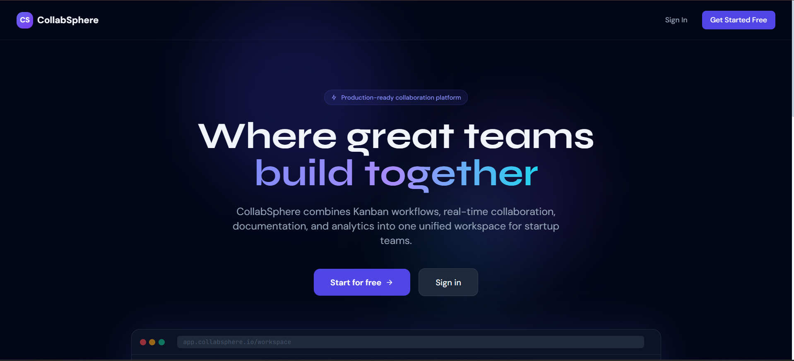
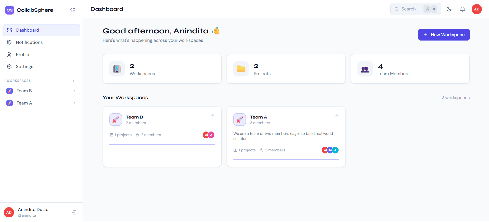
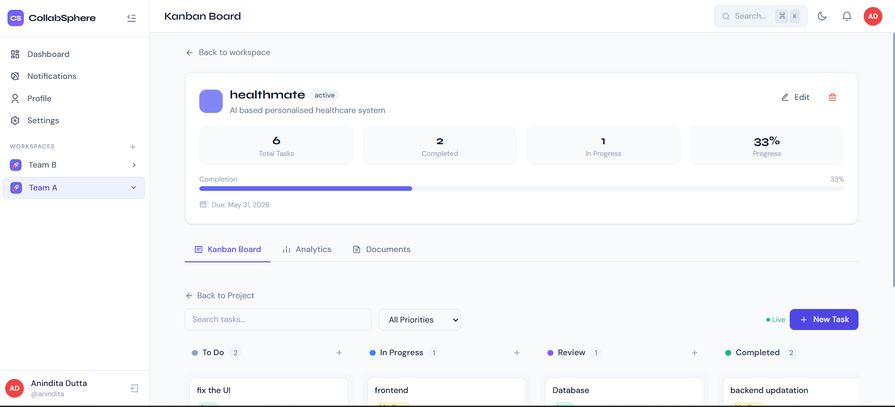
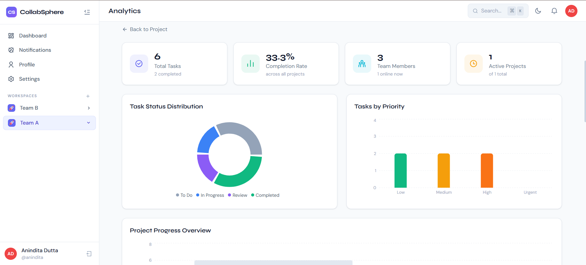
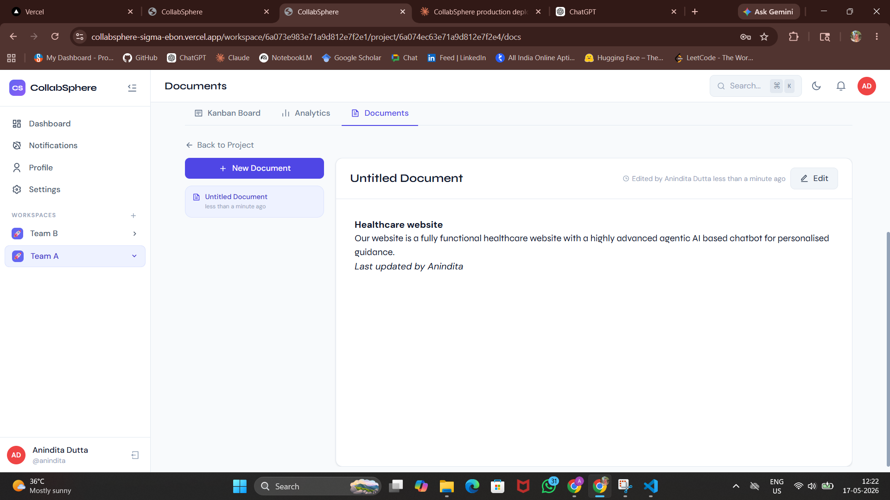
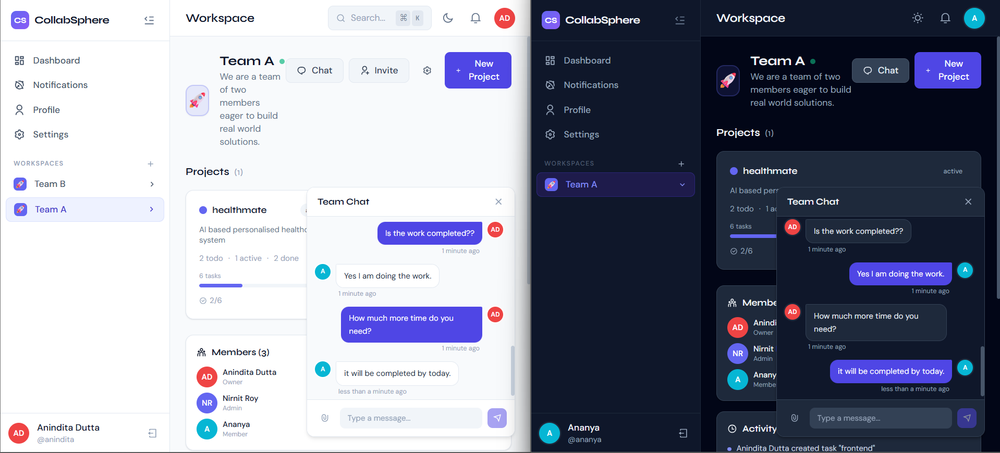

# 🚀 CollabSphere — Production-Grade Project Collaboration Platform

> A modern, full-stack project collaboration system built for startup ecosystems. Combines Kanban workflows, real-time collaboration, documentation, analytics, and team management into one unified workspace.


---

## 🌐 Live Demo

> **🔗 [https://collabsphere-sigma-ebon.vercel.app/](https://collabsphere-sigma-ebon.vercel.app/)**

Try the live deployment — no setup required. Create an account and explore the full platform instantly.

---

## 📸 Screenshots

### Landing Page


### Dashboard


### Kanban Board


### Analytics


### Documents


### Workspace Chat



## ✨ Features

### Core Platform
- 🔐 **JWT Authentication** — Register, login, persistent sessions, password hashing
- 🏢 **Workspaces** — Create and manage collaborative workspaces with roles (Owner, Admin, Member, Viewer)
- 📁 **Projects** — Organize work into projects with status tracking and progress visualization
- 🎯 **Kanban Board** — Full drag-and-drop Kanban with DnD Kit: Todo → In Progress → Review → Completed
- 📊 **Analytics Dashboard** — Recharts-powered insights: completion rates, priority breakdown, contributor stats
- 📝 **Documentation** — Markdown editor with split-pane live preview per project
- 💬 **Team Chat** — Floating real-time workspace chat panel
- 🔔 **Notifications** — Smart in-app notification system for assignments, comments, completions
- 📎 **File Management** — Cloudinary-powered file upload/download with type validation attached to tasks
- ⚡ **WebSocket** — Live updates for tasks, presence indicators, typing indicators
- ✉️ **Email Notifications** — Gmail OAuth2-powered transactional emails for workspace invites and in-app notifications
- 🔗 **Workspace Invitations** — Token-based invite system with dedicated accept flow

### Task Features
- Create / Edit / Delete tasks with full metadata
- Priority labels: Low, Medium, High, Urgent
- Status management with drag-and-drop
- Assignee search & multi-assignment
- Due dates with overdue highlighting
- Tags / Labels
- Task comments with author attribution
- File attachments per task (stored on Cloudinary)
- Task detail slide-in panel

### UI/UX
- 🌙 **Dark/Light Mode** — Sophisticated dual-theme with smooth transitions
- ⌨️ **Command Palette** — Cmd+K search for workspaces and navigation
- 💀 **Loading Skeletons** — Content-aware skeleton loaders
- 🎨 **Animations** — Framer Motion throughout: page transitions, card hovers, slide panels
- 📱 **Responsive** — Works on mobile, tablet, and desktop
- 🎯 **Empty States** — Thoughtful empty state illustrations

---

## 🏗️ Architecture

```
collabsphere/
├── backend/                  # FastAPI Python application
│   ├── app/
│   │   ├── main.py           # Application entry point
│   │   ├── config.py         # Settings / environment variables
│   │   ├── database.py       # MongoDB connection + indexes
│   │   ├── routers/          # API route handlers
│   │   │   ├── auth.py       # Register, login, profile
│   │   │   ├── workspaces.py # Workspace CRUD + members
│   │   │   ├── projects.py   # Project CRUD + analytics
│   │   │   ├── tasks.py      # Task CRUD + comments
│   │   │   ├── files.py      # Cloudinary file upload/download
│   │   │   ├── documents.py  # Markdown docs
│   │   │   ├── notifications.py # Notifications + chat + analytics
│   │   │   └── websocket.py  # WS endpoint
│   │   ├── schemas/
│   │   │   └── schemas.py    # Pydantic request/response models
│   │   ├── middleware/
│   │   │   └── auth_middleware.py # JWT dependency injection
│   │   ├── utils/
│   │   │   ├── auth.py       # JWT + password hashing
│   │   │   ├── email.py      # Gmail OAuth2 email sender
│   │   │   └── helpers.py    # Serialization, utilities
│   │   └── websocket/
│   │       └── manager.py    # WebSocket connection manager
│   ├── uploads/              # Temporary local storage (files go to Cloudinary)
│   ├── requirements.txt
│   └── .env
│
└── frontend/                 # React + Vite application
    ├── src/
    │   ├── App.jsx            # Router + protected routes
    │   ├── main.jsx           # Entry point
    │   ├── index.css          # Tailwind + design tokens
    │   ├── pages/             # Route-level page components
    │   │   ├── Landing.jsx
    │   │   ├── Login.jsx
    │   │   ├── Register.jsx
    │   │   ├── Dashboard.jsx
    │   │   ├── WorkspacePage.jsx
    │   │   ├── ProjectPage.jsx
    │   │   ├── KanbanPage.jsx
    │   │   ├── AnalyticsPage.jsx
    │   │   ├── DocumentsPage.jsx
    │   │   ├── NotificationsPage.jsx
    │   │   ├── ProfilePage.jsx
    │   │   ├── SettingsPage.jsx
    │   │   └── AcceptInvite.jsx   # Workspace invite accept flow
    │   ├── components/
    │   │   ├── layout/        # AppLayout, Sidebar, TopBar
    │   │   ├── ui/            # Reusable components
    │   │   │   ├── Avatar, Badge, Modal, EmptyState
    │   │   │   ├── LoadingScreen, CommandPalette
    │   │   │   ├── WorkspaceModal, ProjectModal
    │   │   │   ├── TaskModal, InviteModal
    │   │   ├── kanban/        # TaskDetailPanel
    │   │   └── chat/          # WorkspaceChat
    │   ├── hooks/             # Custom React hooks
    │   │   ├── useWebSocket.js
    │   │   └── useAsync.js
    │   ├── services/          # API layer
    │   │   ├── api.js         # Axios instance
    │   │   └── apiServices.js # All API calls
    │   ├── store/             # Zustand state management
    │   │   ├── authStore.js
    │   │   └── appStore.js
    │   └── utils/
    │       └── helpers.js     # Formatters, utilities
    ├── package.json
    ├── vite.config.js
    ├── vercel.json            # Vercel deployment config
    ├── tailwind.config.js
    └── .env
```

---

## 🚀 Quick Start

### Prerequisites
- Python 3.12+
- Node.js 18+
- MongoDB 6+ running locally (or a MongoDB Atlas connection string)
- A Cloudinary account (free tier works great)
- A Google Cloud project with Gmail API enabled (for email features)

### 1. Clone and navigate

```bash
git clone <repo-url>
cd collabsphere
```

### 2. Backend Setup

```bash
cd backend

# Create virtual environment
python -m venv venv
source venv/bin/activate          # Linux/macOS
# venv\Scripts\activate           # Windows

# Install dependencies
pip install -r requirements.txt

# Configure environment
cp .env.example .env              # Edit values as needed

# Start the server
uvicorn app.main:app --reload --host 0.0.0.0 --port 8000
```

The API will be available at `http://localhost:8000`  
Interactive docs: `http://localhost:8000/api/docs`

### 3. Frontend Setup

```bash
cd frontend

# Install dependencies
npm install

# Configure environment
cp .env.example .env              # Or edit .env directly

# Start development server
npm run dev
```

The app will be available at `http://localhost:5173`

---

## ⚙️ Environment Variables

### Backend (`backend/.env`)

```env
# App
MONGODB_URL=mongodb://localhost:27017
DATABASE_NAME=collabsphere
SECRET_KEY=your-super-secret-key-change-in-production-min-32-chars
ALGORITHM=HS256
ACCESS_TOKEN_EXPIRE_MINUTES=10080

# File Uploads (Cloudinary)
CLOUDINARY_CLOUD_NAME=your_cloud_name
CLOUDINARY_API_KEY=your_api_key
CLOUDINARY_API_SECRET=your_api_secret
MAX_UPLOAD_SIZE=10485760

# Email (Gmail OAuth2)
GMAIL_CLIENT_ID=your_google_client_id
GMAIL_CLIENT_SECRET=your_google_client_secret
GMAIL_REFRESH_TOKEN=your_gmail_refresh_token
GMAIL_USER=your_gmail_address@gmail.com

# App URLs
FRONTEND_URL=http://localhost:5173
CORS_ORIGINS=http://localhost:5173,http://localhost:3000
```

### Frontend (`frontend/.env`)

```env
VITE_API_BASE_URL=http://localhost:8000/api/v1
VITE_WS_URL=ws://localhost:8000
```

---

## ☁️ Cloud Services

### Cloudinary (File Storage)

CollabSphere uses **Cloudinary** for all file attachments — no files are stored on disk in production. When a user uploads a file to a task or project:

1. The file is received by the FastAPI backend.
2. It is uploaded to Cloudinary with a unique `public_id` under the `collabsphere/` folder.
3. Cloudinary returns a permanent `secure_url` that is stored in MongoDB.
4. Downloads redirect directly to the Cloudinary URL.
5. On deletion, the file is removed from both MongoDB and Cloudinary via `cloudinary.uploader.destroy`.

**Supported file types:** Images (jpg, png, gif, webp), PDFs, text/CSV/Markdown, Office documents (doc, docx, xls, xlsx, ppt, pptx), archives (zip, rar, 7z), code files (py, js, ts, html, css, json, yaml), and more.

**Max file size:** 10 MB per upload.

To set up Cloudinary:
1. Sign up at [cloudinary.com](https://cloudinary.com) (free tier: 25 GB storage, 25 GB bandwidth/month).
2. Go to your Dashboard → copy **Cloud Name**, **API Key**, and **API Secret**.
3. Paste them into `backend/.env`.

### Gmail API (Transactional Email)

CollabSphere uses the **Gmail API with OAuth2** (not SMTP) for sending emails. Two types of emails are sent:

- **Workspace Invitation Email** — sent when a user invites someone to a workspace; contains a styled HTML email with a tokenized accept link valid for 7 days.
- **In-App Notification Email** — sent for events like task assignments, comments, and completions.

The OAuth2 flow uses a long-lived refresh token to obtain fresh access tokens on every send — no password storage required.

To set up Gmail API:
1. Go to [Google Cloud Console](https://console.cloud.google.com) → Create a project.
2. Enable the **Gmail API**.
3. Create **OAuth 2.0 credentials** (Desktop App type).
4. Use the OAuth Playground or a local script to obtain a **refresh token** with the `https://www.googleapis.com/auth/gmail.send` scope.
5. Add the `client_id`, `client_secret`, `refresh_token`, and your Gmail address to `backend/.env`.

---

## 🗄️ Database Schema

### Collections

**users**
```json
{
  "_id": "ObjectId",
  "email": "string (unique)",
  "username": "string (unique)",
  "full_name": "string",
  "hashed_password": "string",
  "bio": "string",
  "avatar_color": "string",
  "timezone": "string",
  "is_active": "boolean",
  "created_at": "datetime",
  "updated_at": "datetime"
}
```

**workspaces**
```json
{
  "_id": "ObjectId",
  "name": "string",
  "description": "string",
  "color": "string",
  "icon": "string",
  "owner_id": "string",
  "members": [
    {
      "user_id": "string",
      "email": "string",
      "full_name": "string",
      "username": "string",
      "role": "owner|admin|member|viewer",
      "avatar_color": "string",
      "joined_at": "datetime"
    }
  ],
  "created_at": "datetime",
  "updated_at": "datetime"
}
```

**projects**
```json
{
  "_id": "ObjectId",
  "workspace_id": "string",
  "name": "string",
  "description": "string",
  "status": "active|on_hold|completed|archived",
  "color": "string",
  "due_date": "datetime",
  "created_by": "string",
  "members": ["string"],
  "created_at": "datetime",
  "updated_at": "datetime"
}
```

**tasks**
```json
{
  "_id": "ObjectId",
  "project_id": "string",
  "workspace_id": "string",
  "title": "string",
  "description": "string",
  "status": "todo|in_progress|review|completed",
  "priority": "low|medium|high|urgent",
  "assignees": ["string"],
  "due_date": "datetime",
  "tags": ["string"],
  "position": "number",
  "created_by": "string",
  "created_at": "datetime",
  "updated_at": "datetime"
}
```

**files**
```json
{
  "_id": "ObjectId",
  "original_name": "string",
  "stored_name": "string (cloudinary public_id)",
  "content_type": "string",
  "size": "number",
  "task_id": "string",
  "project_id": "string",
  "workspace_id": "string",
  "uploaded_by": "string",
  "uploader_name": "string",
  "url": "string (permanent Cloudinary URL)",
  "cloudinary_public_id": "string",
  "created_at": "datetime"
}
```

**comments** · **notifications** · **activity_logs** · **chat_messages** · **documents**

---

## 🌐 API Endpoints

### Authentication
| Method | Endpoint | Description |
|--------|----------|-------------|
| POST | `/api/v1/auth/register` | Register new user |
| POST | `/api/v1/auth/login` | Login with email/password |
| GET | `/api/v1/auth/me` | Get current user |
| PUT | `/api/v1/auth/me` | Update profile |
| PUT | `/api/v1/auth/me/password` | Change password |
| GET | `/api/v1/auth/users/search?q=` | Search users |

### Workspaces
| Method | Endpoint | Description |
|--------|----------|-------------|
| GET | `/api/v1/workspaces` | Get all my workspaces |
| POST | `/api/v1/workspaces` | Create workspace |
| GET | `/api/v1/workspaces/{id}` | Get workspace |
| PUT | `/api/v1/workspaces/{id}` | Update workspace |
| DELETE | `/api/v1/workspaces/{id}` | Delete workspace |
| POST | `/api/v1/workspaces/{id}/invite` | Invite member (sends email) |
| GET | `/api/v1/workspaces/{id}/activity` | Get activity log |

### Files
| Method | Endpoint | Description |
|--------|----------|-------------|
| POST | `/api/v1/files/upload` | Upload file to Cloudinary |
| GET | `/api/v1/files/task/{task_id}` | Get files attached to a task |
| GET | `/api/v1/files/project/{project_id}` | Get files in a project |
| GET | `/api/v1/files/{file_id}/download` | Redirect to Cloudinary download URL |
| DELETE | `/api/v1/files/{file_id}` | Delete from MongoDB + Cloudinary |

### Projects, Tasks, Documents
> Full CRUD + analytics. See `/api/docs` for the complete interactive reference.

### WebSocket
```
ws://localhost:8000/ws/{workspace_id}?token={jwt_token}
```

**Events received:**
- `task_created`, `task_updated`, `task_moved`, `task_deleted`
- `project_created`, `project_updated`, `project_deleted`
- `chat_message`, `notification`
- `presence`, `presence_list`
- `typing`, `document_updated`

**Events sent:**
- `{ type: "ping" }` — Heartbeat
- `{ type: "typing", is_typing: true }` — Typing indicator
- `{ type: "presence_request" }` — Get online users

---

## 🎨 Design System

**Color Palette:**
- Primary: Indigo (`#6366f1`)
- Accent: Violet, Cyan, Emerald, Amber, Rose
- Surface: Slate scale (50–950)

**Typography:**
- Headings: Syne (display font)
- Body: DM Sans
- Code: JetBrains Mono

**Component Classes:**
- `.card` — Elevated card surface
- `.btn-primary`, `.btn-secondary`, `.btn-ghost`, `.btn-danger`
- `.input`, `.label`, `.badge`
- `.sidebar-item` — Navigation items
- `.gradient-text` — Gradient heading text
- `.glass` — Glassmorphism surface

---

## 🔧 Tech Stack

| Layer | Technology |
|-------|-----------|
| Frontend Framework | React 18 + Vite 5 |
| Styling | Tailwind CSS 3.4 |
| Animations | Framer Motion 11 |
| Routing | React Router 6 |
| State Management | Zustand 4 |
| HTTP Client | Axios 1.7 |
| Drag & Drop | DnD Kit 6 |
| Charts | Recharts 2.12 |
| Markdown | React Markdown 9 |
| Icons | React Icons 5 |
| Backend Framework | FastAPI 0.111 |
| ASGI Server | Uvicorn 0.30 |
| Database | MongoDB 6 |
| ODM/Driver | Motor 3.4 (async) |
| Authentication | JWT (python-jose) |
| Password Hashing | Passlib + bcrypt |
| File Storage | Cloudinary SDK |
| Email | Gmail API (OAuth2) via httpx |
| WebSockets | FastAPI native |
| Validation | Pydantic v2 |

---

## 📦 Installation Commands

### Backend
```bash
pip install fastapi==0.111.0 uvicorn[standard]==0.30.1 motor==3.4.0 \
  pymongo==4.7.2 pydantic==2.7.1 pydantic-settings==2.3.0 \
  python-jose[cryptography]==3.3.0 passlib[bcrypt]==1.7.4 \
  python-multipart==0.0.9 aiofiles==23.2.1 python-dotenv==1.0.1 \
  websockets==12.0 bcrypt==4.1.3 email-validator==2.1.1 \
  cloudinary httpx
```

### Frontend
```bash
npm install react react-dom react-router-dom axios framer-motion \
  react-icons recharts zustand @dnd-kit/core @dnd-kit/sortable \
  @dnd-kit/utilities react-hot-toast react-markdown date-fns clsx
```

---

## 🚢 Deployment Guide

### MongoDB
Use MongoDB Atlas (free tier) for production:
1. Create account at [mongodb.com/atlas](https://mongodb.com/atlas)
2. Create cluster → Get connection string
3. Set `MONGODB_URL` in backend `.env`

### Backend (Render / Railway / EC2)
```bash
# Procfile or render.yaml start command
web: uvicorn app.main:app --host 0.0.0.0 --port $PORT

# Or run directly
uvicorn app.main:app --host 0.0.0.0 --port 8000 --workers 4
```

Set all environment variables (MongoDB, Cloudinary, Gmail, JWT secret) in your hosting platform's dashboard.

### Frontend (Vercel)
The project includes a `vercel.json` for zero-config Vercel deployment.

```bash
npm run build
# Deploy the `dist/` folder, or connect repo directly to Vercel
```

Set environment variables in Vercel dashboard:
```env
VITE_API_BASE_URL=https://your-api-domain.com/api/v1
VITE_WS_URL=wss://your-api-domain.com
```

### CORS Configuration
Update `CORS_ORIGINS` in backend `.env`:
```env
CORS_ORIGINS=https://your-frontend-domain.com
```

---

## 🛠️ Development Tips

- API docs available at `http://localhost:8000/api/docs` (Swagger UI)
- Use `Cmd+K` / `Ctrl+K` to open command palette
- WebSocket reconnects automatically on disconnect
- All MongoDB operations are async (Motor)
- Files are uploaded to Cloudinary — the local `uploads/` folder is only a fallback; add it to `.gitignore`
- JWT tokens expire in 7 days by default
- Email sending is non-blocking; failures are logged but do not break the API response

---

## 📋 Known Limitations

- No email verification flow on register (can be added with the existing Gmail OAuth2 setup)
- No 2FA (architecture supports adding it)
- WebSocket state resyncs on reconnect (not event-sourced)
- Cloudinary free tier has monthly bandwidth limits; upgrade for high-traffic production use

---

## 🔮 Future Advancements

> These are features **not yet built** — they represent the roadmap for where CollabSphere is headed. None of these exist in the current version. They are listed here for contributors, collaborators, and anyone who wants to understand the vision of the platform.

---

### 🔗 GitHub Integration — Sync Commits & PRs to CollabSphere Tasks

The biggest planned advancement is a **native GitHub integration** that bridges your code activity directly with your CollabSphere workspace. The idea is simple: when your team pushes code to GitHub, CollabSphere should know about it — automatically.

**What this would look like in practice:**

- A developer commits code with a message like `fix: resolve login bug [TASK-42]` → CollabSphere automatically moves Task #42 from *In Progress* to *Review* on the Kanban board.
- A pull request is opened on GitHub → a linked activity entry appears on the related CollabSphere task, showing the PR title, author, and status.
- A PR is merged → the linked task is marked *Completed* and the assignee gets a CollabSphere notification.
- A GitHub issue is created → it can be imported as a CollabSphere task directly inside the project.
- The task detail panel shows a **"Linked Commits"** section — a live feed of every commit, branch, and PR tied to that task.

**How it would be built (technical plan):**

- **GitHub Webhooks** — GitHub sends a POST request to a CollabSphere endpoint (`/api/v1/integrations/github/webhook`) on every push, PR open/merge, and issue event.
- **Task keyword matching** — the backend parses commit messages and PR titles for task references (e.g., `[TASK-42]`, `closes #42`, `fix TASK-42`) and updates the matched task automatically.
- **OAuth App** — users connect their GitHub account to CollabSphere via GitHub OAuth, allowing per-workspace repo linking from the Settings page.
- **Repo linking UI** — inside workspace Settings, a new "Integrations" tab lets the owner link one or more GitHub repositories to the workspace.
- **Activity log enrichment** — all GitHub events (commits, PRs, merges) are stored in the existing `activity_logs` collection and surfaced in the task detail panel and analytics dashboard.

This would make CollabSphere a true **developer-first** project management tool — where your Kanban board stays in sync with your codebase without any manual updates.

---

### 🗺️ Other Planned Features

#### Authentication & Security
- [ ] **Email verification on registration** — OTP or magic link via the existing Gmail OAuth2 setup
- [ ] **Two-factor authentication (2FA)** — TOTP-based (Google Authenticator / Authy)
- [ ] **OAuth login** — Sign in with Google / GitHub
- [ ] **Session management** — View and revoke active sessions per device

#### Collaboration
- [ ] **@mentions in comments** — Notify specific teammates inline
- [ ] **Threaded comments** — Reply chains on tasks
- [ ] **Reaction emojis** on comments and chat messages
- [ ] **Shared document editing** — Real-time collaborative markdown (like Google Docs, powered by WebSockets + OT/CRDT)

#### Tasks & Projects
- [ ] **Recurring tasks** — Daily / weekly / monthly task templates
- [ ] **Task dependencies** — Block a task until another is completed
- [ ] **Time tracking** — Log hours per task with a built-in timer
- [ ] **Subtasks** — Nested checklist inside a task
- [ ] **Gantt / Timeline view** — Visual project timeline alongside Kanban
- [ ] **Calendar view** — See tasks by due date in a monthly calendar

#### Notifications & Email
- [ ] **Email digest** — Daily or weekly summary email of workspace activity
- [ ] **Push notifications** — Browser push (PWA) and mobile notifications
- [ ] **Notification preferences** — Per-user, per-workspace granular controls (e.g., mute a project)

#### Files & Storage
- [ ] **File preview in-app** — Inline image previews and PDF viewer inside the task panel
- [ ] **Version history for documents** — Track and restore previous versions of markdown docs

#### Analytics & Reporting
- [ ] **Exportable reports** — Download project analytics as PDF or CSV
- [ ] **Burndown charts** — Sprint progress visualization
- [ ] **Member performance insights** — Tasks completed per user over time

---

## 🤝 Contributing

1. Fork the repository
2. Create feature branch: `git checkout -b feat/your-feature`
3. Commit: `git commit -m 'feat: add your feature'`
4. Push: `git push origin feat/your-feature`
5. Open a Pull Request

---

## 📄 License

MIT License — See LICENSE file for details.

---

*Built with ❤️ using FastAPI, React, MongoDB, Cloudinary, and Gmail API*